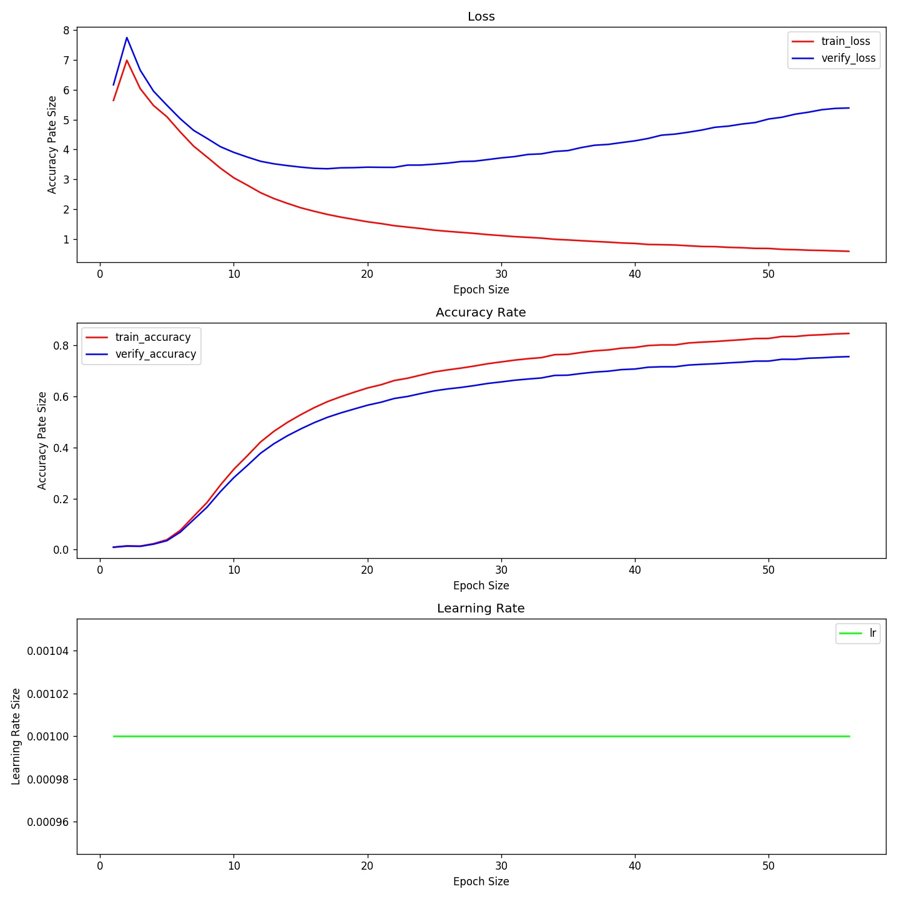
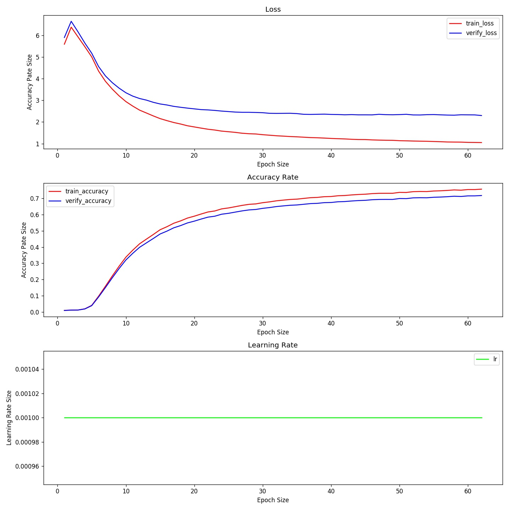
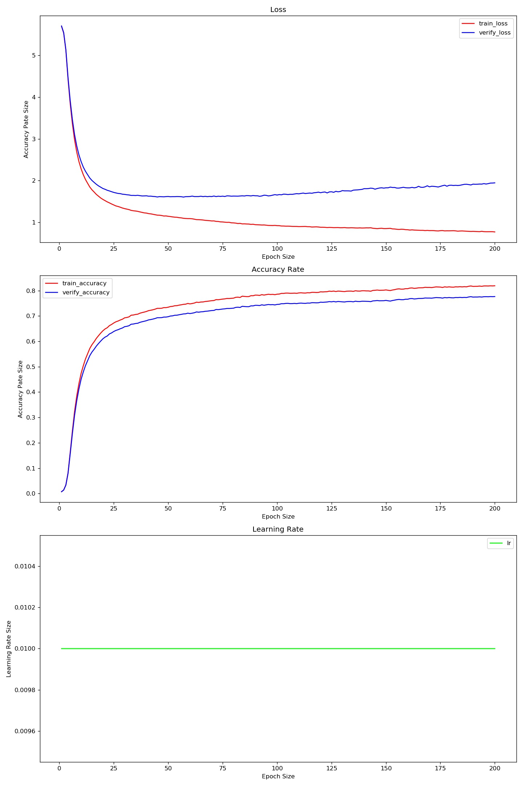
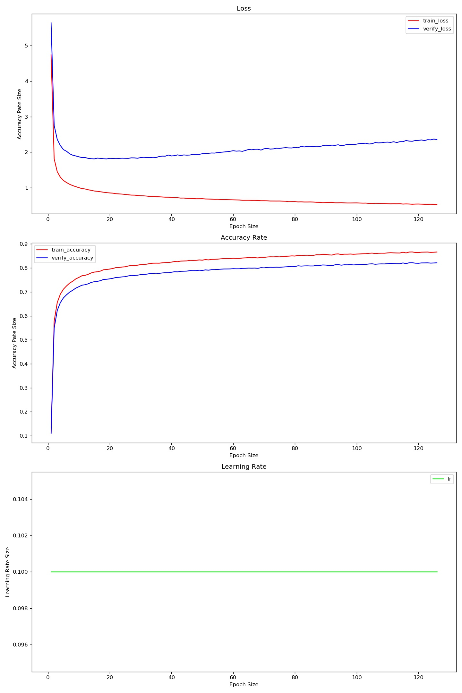

- 

- 

- 随机梯度下降

- 学习率衰减策略

- 交叉熵损失函数

- Inception-resnet-v2

  - 卷积
  - 池化
  - 激活
  - liner
  - 正则化

- 数据增强

  - 随机翻转

  - 归一化

  - 随机色相亮度等

  - 随机剪裁

    

## 4月10号下午3点

- **epoch：** 120(早停)
- **batch size：** 64
- **learning rate：** 0.001
- **dropout：** 0.8
- **dataset scale：** 8-1-1
- **weigth decay：** 1e-2
- **optimizer：** AdamW

## **4月11号凌晨3点**

**做了训练数据的增强，随机翻转，随机对比度色相亮度，随机选取以及修改数据比例**

- **epoch：** 120(62停)
- **batch size：** 64
- **learning rate：** 0.001
- **dropout：**  0.8
- **weigth decay：** 1e-2
- **dataset scale：** 90-5-5
- **optimizer：** AdamW

## **4月12号上午11点**

**换SGD优化器，设置L2权重衰减，提高学习率**

- **epoch：** 500(200停)
- **batch size：** 32
- **learning rate：** 0.01
- **dropout：** 0.8
- **dataset scale：** 90-5-5
- **weigth decay：** 1e-5
- **optimizer：** SGD

## **4月13号晚上19点**

**加载上次模型，提高学习率训练**

- **epoch：** 500(126停)
- **batch size：** 32
- **learning rate：** 0.1
- **dropout：** 0.8
- **dataset scale：** 90-5-5
- **weigth decay：** 1e-5
- **optimizer：** SGD

